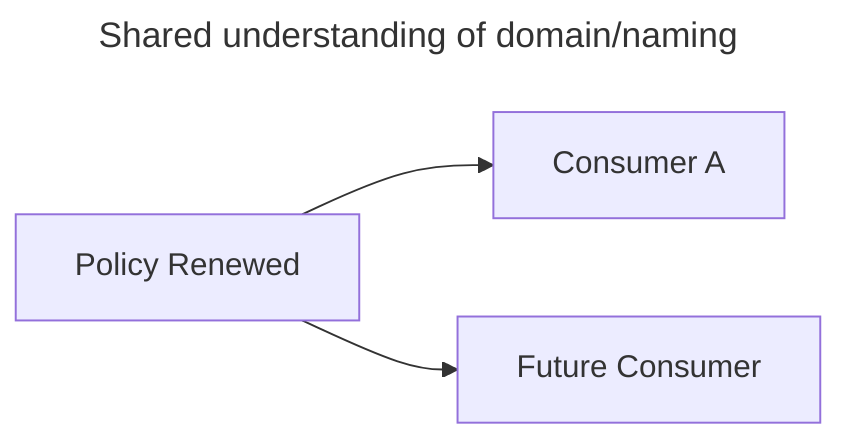

# Event Driven Architecture

## Modern Integration Patterns

**Integration** — An integration connects data, applications, and services across our estate. Common integration methods are **files**, **messages** and **APIs**

**Integration Pattern** — An integration pattern is a standardized method for implementing integrations. Common patterns are **point-to-point**, **publish/subscribe**, and **request/response**. Integration patterns make it easier to connect our estate by providing best-practice designs for solving different use cases. Over time, these patterns have evolved, and more "modern" patterns come with additional benefits to "older" patterns.

## Why adopt Modern Integration Patterns

- Well-defined boundaries and ownership of data and applications
- Higher flexibility and quicker time to market for making new changes or releasing new applications
- Reduce the dependency on other teams when building and releasing new features
- Adopt new trends for Data and Analytics
- Readiness to support new transformation initiatives (like Cloud adoption containerization)
- Better interfaces for internal and external communication
- Scalability and Resilience by design
- Support for Real-time data processing, insights, and analytics
- Agility and Flexibility for development teams
- Readiness for Innovation. Enables transformation for future trends and quicker adoption of newer technologies

## Evolution of Modern Integration Patterns

### Typical Integration Methods

| **Method**       | **Within Domain** | **Between Domains** | **Pros**                      | **Cons**                                                              |
|------------------|-------------------|---------------------|-------------------------------|-----------------------------------------------------------------------|
| File             | Option            | Migrate             | Simple, established           | Limited interface re-use                                              |
| Direct DB Access | Do not use        | Do not use          | Quick time to market          | Very tightly coupled                                                  |
| DB Replication   | Option            | Do not use          | Simple                        | Tightly coupled                                                       |
| ΑΡΙ              | Option            | Strategic           | De-coupled, request/response  | More suitable for 1:1 integrations than 1:M                           |
| Message (MQ)     | Strategic         | Migrate             | Fast, established             | Tightly coupled                                                       |
| Event (Kafka)    | Option            | Strategic           | De-coupled, publish/subscribe | More Suitable for 1:M type of integrations for large scale operations |

## Event-Driven Architecture

### Modes of communication

Modern applications typically communicate with other applications and services either **synchronously** or **asynchronously**. 

Communication is **synchronous** when the **sender waits for the receiver** and vice versa before continuing. **Request/response** patterns are typically synchronous.

**Asynchronous** communication occurs when messages or information are **sent and received at different times**, eliminating the need for an immediate response. **Publish/Subscribe patterns are asynchronous**.

### Events & Event-Driven Architecture

Decoupled systems that trigger/execute in response to events

An event-driven architecture uses **events** to **trigger** and **communicate** between **decoupled** services & applications. An event is a **state change** or an **update**, for example, an item being placed in a shopping cart on an e-commerce website.

Key to **Event-driven architectures** (EDA) are **event producers** and **event consumers**.

The **producers and consumers are decoupled**, which allows them to be scaled, updated, and deployed independently.

